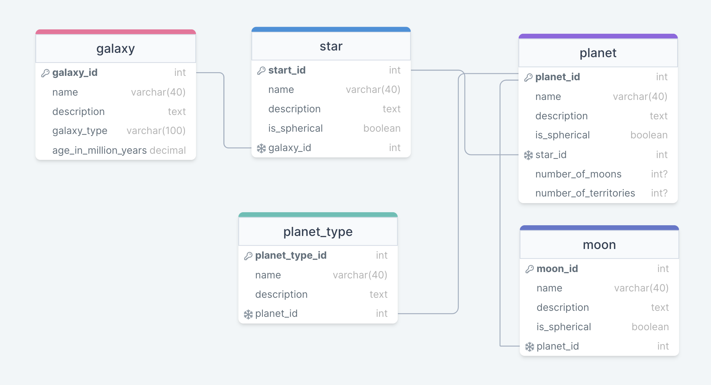

# Universe Database

## Description 
A databases containing tables of our universe, these includes planets, moons, galaxies, stars.

## Model

[universe db](https://drawsql.app/teams/pardon/diagrams/universe-db)

## Dump
[universe dump file](./universe.sql)
